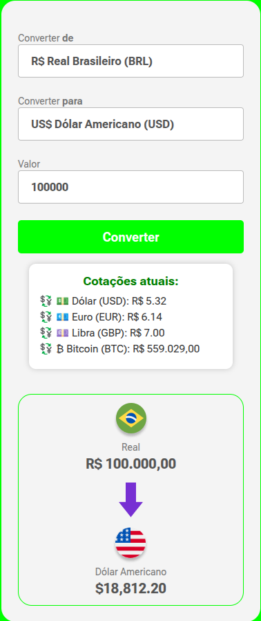

# 💱 Conversor de Moedas

## 📝 Descrição
Este projeto foi desenvolvido para praticar **HTML**, **CSS** e **JavaScript**, aplicando o consumo de uma **API de câmbio em tempo real** para realizar conversões entre diferentes moedas.

O objetivo foi exercitar a manipulação do **DOM**, o uso de **funções assíncronas (async/await)** e a integração com APIs externas, além de consolidar o uso de formatação monetária com o objeto `Intl.NumberFormat`.

O site permite converter valores de **Real (BRL)** para **Dólar (USD)**, **Euro (EUR)**, **Libra Esterlina (GBP)** e **Bitcoin (BTC)**, com exibição dinâmica de bandeiras e nomes das moedas.

---

## 🧠 Tecnologias utilizadas
- **HTML5** — estrutura da aplicação  
- **CSS3** — estilização e layout responsivo  
- **JavaScript (ES6)** — lógica de conversão e integração com API  
- **AwesomeAPI** — fonte das cotações em tempo real  

---

## 🖼️ Layout do projeto


> *(Substitua o arquivo `assets/preview.png` pela captura de tela do seu projeto rodando localmente.)*

---

## ⚙️ Funcionalidades
- Conversão entre **BRL**, **USD**, **EUR**, **GBP** e **BTC**  
- Atualização automática das taxas de câmbio via API  
- Exibição do nome e bandeira correspondentes à moeda selecionada  
- Formatação de valores segundo o padrão de cada país  
- Interface simples, limpa e responsiva  

---

## 🚀 Como executar o projeto
1. Clone este repositório:
   ```bash
   git clone https://github.com/Hemmercamp/Conversor-de-Moedas.git
   ```
2. Abra o arquivo `index.html` no navegador.

---

## 🧑‍💻 Autor
**Emerson Eruédinos da Silva**  
💼 GitHub: [@Hemmercamp](https://github.com/Hemmercamp)  
📧 E-mail: contatohemersonoficial@gmail.com

---

✨ *Feito com foco em aprendizado, integração de APIs e boas práticas de código!*
